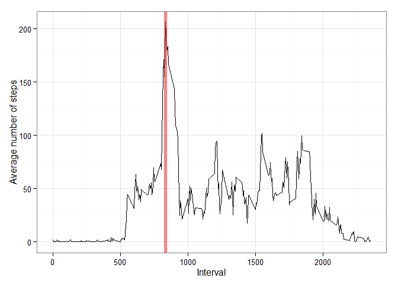

# Reproducible Research: Peer Assessment 1

## Loading and preprocessing the data


We first check if the dataset is located in the current working directory, and if not, we download it:

```r
if(!file.exists("./activity.zip")){
    data_url = "https://d396qusza40orc.cloudfront.net/repdata%2Fdata%2Factivity.zip"
    download.file(data_url,destfile = "./activity.zip")
}
```
We then read the dataset from the zipped file:

```r
data <- read.csv(unz("activity.zip", filename = "activity.csv"))
```

The file contains 17568 rows and 3 columns:

```
##   steps       date interval
## 1    NA 2012-10-01        0
## 2    NA 2012-10-01        5
## 3    NA 2012-10-01       10
## 4    NA 2012-10-01       15
```

The dataset doesn't require too much work to be clean. We simply turn the date column to Date object:

```r
data[,2] <- as.Date(data[, 2], "%Y-%m-%d")
```

The dataset, loaded in the data data.frame is ready to answer our questions.

## What is mean total number of steps taken per day?

We're interested in the average total number of steps taken per day. We compute the values required (average # steps/day + date) using the aggregate function, and store the result in a new data.frame.


```r
steps_per_day <- with(data, aggregate(data[1], 
                                      by = list(Date = date), 
                                      FUN = sum, na.rm = TRUE))
head(steps_per_day, n=4)
```

```
##         Date steps
## 1 2012-10-01     0
## 2 2012-10-02   126
## 3 2012-10-03 11352
## 4 2012-10-04 12116
```

We use this new data.frame to produce the required plot.

```r
library(ggplot2)

g <- ggplot(data = steps_per_day, aes(x = Date, y = steps))
g <- g + geom_histogram(stat = "identity")
g <- g + theme_bw()
g <- g + xlab("Day") + ylab("Total number of steps per day")
g
```

 

The plot above gives the average number of steps per day, for each day from the dataset. The total number of steps averaged on all dates is:


```r
mean(steps_per_day$steps, na.rm = TRUE)
```

```
## [1] 9354
```

The median is:


```r
median(steps_per_day$steps, na.rm = TRUE)
```

```
## [1] 10395
```


## What is the average daily activity pattern?

In this question, we are interested in the number of steps, averaged on all the dates, for each 5 minutes intervals.

Again, we use the aggregate function to obtain these values:


```r
avg_steps_per_intvl <- with(data, aggregate(data$steps, 
                                            by = list(interval = interval), 
                                            FUN = mean, na.rm = TRUE))

names(avg_steps_per_intvl)[2] <- "Average.Steps"
head(avg_steps_per_intvl, n=5)
```

```
##   interval Average.Steps
## 1        0       1.71698
## 2        5       0.33962
## 3       10       0.13208
## 4       15       0.15094
## 5       20       0.07547
```

The plot is obtained with the following code (using ggplot2 again):


```r
g <- ggplot(data = avg_steps_per_intvl, aes(x = interval, y = Average.Steps))
g <- g + geom_line()
g <- g + theme_bw()
g <- g + xlab("Interval") + ylab("Average number of steps")
```
 

The time interval with the maximum number of steps, shown in the above plot by the red line, is given simply by:


```r
avg_steps_per_intvl[which.max(avg_steps_per_intvl$Average.Steps), 1]
```

```
## [1] 835
```

It is the interval 835.


## Imputing missing values

In this question, we take care of the missing values of the dataset. All are located in the "steps" column. 

```r
table(is.na(data$steps))
```

```
## 
## FALSE  TRUE 
## 15264  2304
```

The missing values are to be replaced by the average number of steps for the corresponding time interval, that we computed for the previous question.

The following code takes care of the transformation (requires the sqldf package):

```r
steps_col <- data$steps # extract a vector of steps from the data.frame

intervals <- subset(data, is.na(data$steps), select = c(3)) # get the intervals for which the steps value is missing

library(sqldf) # I chose to use sqldf because I like SQL :)

avg_steps <- (sqldf("select * from intervals a, avg_steps_per_intvl b \
                   where a.interval = b.interval"))[[3]] # For every interval in the intervals vector, I look for the average number of steps. And I extract a steps vector that will be used to replace the missing values

steps_col[is.na(steps_col)] <- avg_steps # replace the NA values with the average number of steps for this interval

data$steps <- steps_col # and inject the steps vector back into the data.frame. data$steps has no more missing values
```

**Proof:**


```r
table(is.na(data$steps))
```

```
## 
## FALSE 
## 17568
```

There is no missing value left.

We can replot the mean total number of steps taken per day (see *What is mean total number of steps taken per day?* section). The plot is produced in the exact same way as before.

 

The new mean and median are 1.0766 &times; 10<sup>4</sup> and 1.0766 &times; 10<sup>4</sup> respectively, to be compared with the previous values of 9354.2295 and 10395. We can clearly see the difference.


## Are there differences in activity patterns between weekdays and weekends?

I need to add a day column in the data.frame (maybe there is an easier way to do that, but I don't know how).


```r
days <- weekdays(data$date)
data$day <- days
```

I create a new data.frame that I will use to add the Weekday-Weekend information in the data.frame


```r
weekpos <- c(rep("Weekday", 5), rep("Weekend", 2))

df <- data.frame(day = unique(days), weekpos = weekpos)
```

And add a new column to the data.frame:

```r
data$weekpos <- sqldf("select b.weekpos from data a, df b where a.day = b.day")[[1]]

data[sample(nrow(data), 5), ]
```

```
##       steps       date interval      day weekpos
## 2692      0 2012-10-10      815 mercredi Weekday
## 16271   374 2012-11-26     1150    lundi Weekday
## 15893     0 2012-11-25      420 dimanche Weekend
## 15993     0 2012-11-25     1240 dimanche Weekend
## 10869   260 2012-11-07     1740 mercredi Weekday
```

To answer the question, we once again use the aggregate function:


```r
avg_steps_per_intvl_q4 <- with(data, aggregate(data$steps, 
                                            by = list(weekpos = weekpos, 
                                                      interval = interval), 
                                            FUN = mean, na.rm = TRUE))

names(avg_steps_per_intvl_q4)[3] <- "Average.Steps"
```

And plot using ggplot2


```r
g_q4 <- ggplot(data = avg_steps_per_intvl_q4, aes(x = interval, y = Average.Steps))
g_q4 <- g_q4 + geom_line()
g_q4 <- g_q4 + theme_bw()
g_q4 <- g_q4 + xlab("Interval") + ylab("Average number of steps")
g_q4 <- g_q4 + facet_grid(weekpos ~ .)
g_q4
```

 

The differences can be clearly seen. The average number of steps seems to be lower during the weekend.

We can also notice that the activities seem to start later during the weekend, which is probably only because people sleep later and don't have to go to their job.

The afternoon is a little more active during the weekend than the weekdays. I assume this is because during the week, people are working during the afternoon, whereas they're free during the weekend, and tend to go out, and not stay at their desk.
